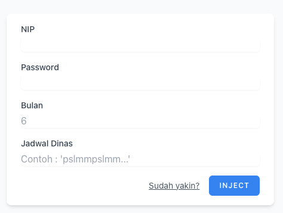

# Autofilling Job Activities for Civil Servant (Samarinda)

### You can access [website here](http://36.66.236.83/elogbook-samarinda/)
### Requirements : 
+ Latest Chrome Browser
+ Node js


# How to Use it
+ Download project or
```
git clone https://github.com/rabianikwan/Autosign-Project
```
+ From downloaded folder use terminal
```
npm install
cd client
npm run build:react
```
+ run script :
```
cd
npm run start
```

## fill form and Inject and Selenium will excecuted




